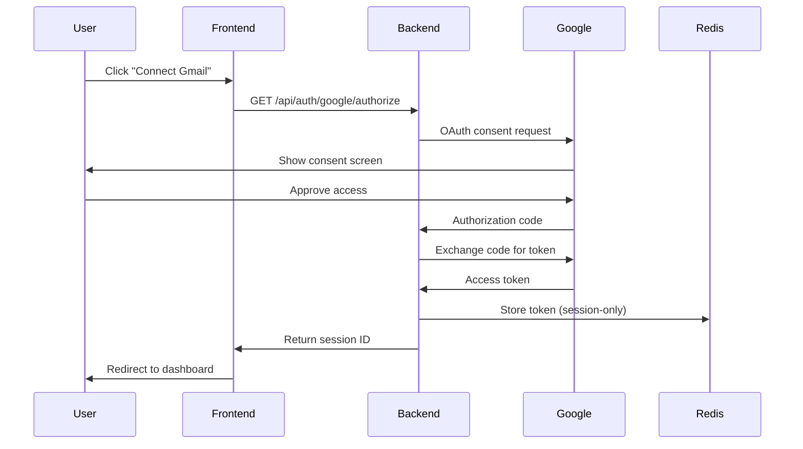

# **Product Requirements Document (PRD) - Updated**

## **Project Name:** Pratyaksh

### **Tagline:** Bringing your shadow data into the light.

---

## 1. Overview

### 1.1 Problem Statement

Modern users suffer from **Digital Obesity** — dozens (sometimes hundreds) of forgotten online accounts created over years. These abandoned services often retain **sensitive personal data** such as:

* Email addresses
* Phone numbers
* Home addresses
* Saved payment methods
* Authentication credentials

When obscure or poorly maintained platforms are breached, the user's **core digital identity** becomes vulnerable — without the user even knowing the risk exists.

**Key Insight:** People don't lose privacy because they overshare — they lose it because they forget.

---

### 1.2 Solution Summary

**Pratyaksh** is a privacy-first web application that:

1. Securely connects to a user's email via OAuth
2. Scans email **metadata only** to identify services the user has signed up for
3. Builds a **visual risk map** of the user's digital footprint
4. Enables **one-click GDPR/CCPA data deletion requests**

Pratyaksh doesn't just *inform* — it enables *action*.

---

## 2. Goals & Success Metrics

### 2.1 Product Goals

* Help users **discover forgotten digital accounts**
* Quantify **privacy and breach risk**
* Enable **frictionless data deletion**
* Demonstrate **privacy-by-design** principles

### 2.2 Hackathon Success Metrics

* User can connect email and see results in **< 60 seconds**
* At least **1 strong demo moment** (Kill Switch / Risk Map)
* Clear explanation of **why this matters now**
* Strong alignment with **privacy, cybersecurity, and compliance themes**

---

## 3. Target Users

### Primary Users

* Tech-savvy individuals
* Students & professionals
* Privacy-conscious users
* Anyone who has used the internet for 5+ years

### Secondary Users (Future)

* Security teams
* Privacy consultants
* Enterprises offering privacy audits

---

## 4. User Journey

1. **Landing Page**
   * Clear value proposition
   * "Connect your email securely" CTA
   * Trust indicators (privacy policy, no data storage)

2. **OAuth Consent**
   * Read-only access
   * Explicit message: *"We only read email headers. No email content is accessed or stored."*
   
3. **Scanning Phase**
   * Animated "Scanning your digital footprint…"
   * Progress indicator showing # of emails scanned

4. **Risk Map Dashboard**
   * Visual map of discovered services
   * Risk tiers & breach indicators
   * Summary stats (total accounts, high-risk count, breach exposure)

5. **Action Layer**
   * Individual "Delete Me" buttons
   * Bulk "Kill Switch" option
   * Email template preview before sending

6. **Completion**
   * Summary of actions taken
   * Optional logout & data purge
   * Reminder to revoke OAuth access

---

## 5. Core Features

---

### 5.1 Email Scanner (Data Extraction Layer)

#### Description
Securely analyzes **email metadata only** to identify platforms the user has signed up for.

#### Technical Specifications

**Scope:**
* Gmail via Google OAuth 2.0 (hackathon scope)
* Access only: `gmail.readonly` scope
* Data accessed: Subject, From, Date headers only
* **No email body content accessed or stored**

**Keywords Detected:**
* "Welcome to"
* "Confirm your account"
* "Verify your email"
* "Privacy Policy update"
* "Your receipt from"
* "Account created"
* "Registration confirmation"
* "Thank you for signing up"

**Parsing Logic:**

```python
# Pseudocode
def extract_service(email_from):
    # Extract domain from email sender
    # Example: noreply@spotify.com → spotify.com
    domain = regex_extract_domain(email_from)
    
    # Clean common subdomains
    domain = remove_subdomain(domain)  # mail.spotify.com → spotify.com
    
    # Lookup service name from domain
    service_name = get_service_name(domain)  # spotify.com → Spotify
    
    return {
        'domain': domain,
        'service_name': service_name,
        'first_seen': email_date
    }
```

**Email Query Parameters:**
* Date range: Last 5 years (configurable)
* Max emails scanned: 5000 (to avoid rate limits)
* Search query: `subject:(welcome OR verify OR confirm OR "thank you for signing up")`

**Output:**
A deduplicated list of services with metadata:

```json
[
  {
    "domain": "spotify.com",
    "service_name": "Spotify",
    "first_seen": "2019-03-15",
    "category": "Entertainment",
    "risk_level": "Medium"
  }
]
```

---

### 5.2 Risk Engine

#### Description
Categorizes each discovered service based on **data sensitivity** and **breach history**.

#### Risk Calculation Formula

```
Risk Score = (Data Sensitivity × 0.6) + (Breach History × 0.4)
```

#### Risk Tiers

**High Risk (Score: 7-10)**
* Finance (banks, payment processors, crypto)
* Healthcare (medical portals, insurance)
* Government (tax, benefits, official documents)
* Dating apps (highly personal data)

**Medium Risk (Score: 4-6)**
* E-commerce (shopping, retail)
* Social media (personal networks)
* Professional services (LinkedIn, resume sites)
* Travel booking

**Low Risk (Score: 1-3)**
* Newsletters
* Forums
* Blogs
* Promotional content

#### Data Categories

**Service Category Mapping:**

```json
{
  "paypal.com": {
    "category": "Finance",
    "data_sensitivity": 9,
    "typical_data": ["Payment info", "Bank accounts", "Transaction history"]
  },
  "spotify.com": {
    "category": "Entertainment",
    "data_sensitivity": 4,
    "typical_data": ["Email", "Listening history", "Playlists"]
  }
}
```

#### Breach Awareness Integration

**Have I Been Pwned API Integration:**

```python
# API call structure
GET https://haveibeenpwned.com/api/v3/breaches?domain=adobe.com

# Response handling
{
  "breach_count": 3,
  "latest_breach": "2023-05-12",
  "total_accounts_affected": 153000000
}
```

**Display Logic:**
* Show breach badge if `breach_count > 0`
* Color-code by recency:
  - Red: Breach within last year
  - Orange: Breach within last 3 years
  - Gray: Older breaches

---

### 5.3 Visual Risk Map

#### Description
An interactive graphical representation of the user's digital footprint.

#### Design Specifications

**Layout:**
* User avatar at the center
* Services positioned in concentric circles based on risk level
* Inner circle: High risk
* Middle circle: Medium risk
* Outer circle: Low risk

**Visual Properties:**

```javascript
// Node styling
{
  color: {
    high_risk: '#EF4444',    // Red
    medium_risk: '#F59E0B',  // Orange
    low_risk: '#10B981'      // Green
  },
  size: {
    calculation: 'data_sensitivity * 10 + 20',  // px
    min: 30,
    max: 80
  },
  breach_indicator: {
    border: '3px solid #DC2626',
    pulse_animation: true
  }
}
```

**Interaction:**
* Hover: Show service name, risk score, breach status
* Click: Expand card with details and action buttons
* Filter: Toggle risk levels on/off
* Search: Highlight matching services

**Tech Implementation:**
* Library: D3.js (v7) or React Flow
* Animation: Smooth transitions (300ms ease-in-out)
* Responsive: Canvas adapts to screen size

---

### 5.4 Right to Be Forgotten (Action Layer)

#### Description
Enables users to reclaim privacy using existing data protection laws (GDPR, CCPA).

#### Technical Implementation

**Email Template System:**

```javascript
// Template structure
const gdprTemplate = {
  to: 'privacy@{domain}',  // Auto-populated
  cc: 'dpo@{domain}',      // Optional DPO email
  subject: 'GDPR Data Deletion Request - {user_email}',
  body: `
Dear Data Protection Officer,

I am writing to formally request the deletion of all personal data associated with my account under Article 17 of the GDPR (Right to Erasure).

Account Email: {user_email}
Service: {service_name}
Date of Request: {current_date}

Please confirm receipt of this request and complete the deletion within 30 days as required by law.

If you require additional verification, please respond to this email.

Sincerely,
{user_name}
  `
};
```

**Regional Template Selection:**

```python
def get_deletion_template(user_location, service_domain):
    if user_location in ['EU', 'UK']:
        return gdpr_template
    elif user_location in ['US-CA']:
        return ccpa_template
    else:
        return generic_template
```

**Email Privacy Lookup:**

**Priority order for finding privacy contact:**
1. Check common privacy emails: `privacy@, dpo@, legal@`
2. Parse privacy policy URL for contact info
3. Use generic `support@` as fallback
4. Display manual instructions if automated email fails

**Action Workflow:**

```
1. User clicks "Delete Me" → 
2. Template preview modal opens → 
3. User reviews/edits content → 
4. Confirm send → 
5. Email sent via backend SMTP → 
6. Confirmation message + tracking ID → 
7. Optional: 30-day reminder to follow up
```

**Email Delivery Methods:**
* **Option 1:** Generate mailto: link (user sends from their client)
* **Option 2:** Backend SMTP relay (requires user email OAuth)
* **Hackathon scope:** Use Option 1 for simplicity

---

### 5.5 The Kill Switch (Demo Feature)

#### Description
A powerful bulk deletion feature that creates maximum impact during demos.

#### UX Flow

**Selection Interface:**
* Multi-select checkboxes on each service card
* "Select All High Risk" quick action
* "Select All Breached" quick action
* Selected count indicator

**Activation:**

```javascript
// Button state
<button 
  disabled={selectedServices.length === 0}
  className="kill-switch-button"
  onClick={handleKillSwitch}
>
  🔥 KILL SWITCH ({selectedServices.length})
</button>
```

**Confirmation Modal:**

```
⚠️ You're about to request deletion from 47 services

This will:
✓ Generate 47 GDPR deletion request emails
✓ Copy all emails to your clipboard
✓ Open your email client for review

This action cannot be undone.

[Cancel] [Proceed with Kill Switch]
```

**Execution:**
1. Generate all deletion emails in batch
2. Combine into single text block (copy-pasteable)
3. Open default email client with batch composition
4. Show success summary screen

**Demo Impact:**
* Visual animation: Services "disappearing" from risk map
* Counter showing emails generated
* Estimated data value reclaimed: "₹11,800 worth of data protected"

---

### 5.6 Data Value Calculator

#### Description
Estimates the **advertising value** of the user's exposed data.

#### Calculation Model

**Industry CPM Rates:**

```python
ad_value_per_category = {
    'Finance': 25.00,      # ₹ per 1000 impressions
    'Healthcare': 20.00,
    'E-commerce': 8.00,
    'Social Media': 5.00,
    'Entertainment': 3.00,
    'News': 2.00
}

# Formula
total_value = sum(
    service.category_cpm * 
    service.estimated_monthly_interactions * 
    12  # Annual value
) / 1000
```

**Display:**

```
💰 Your Data Value Estimate

Your personal data is currently exposed across 84 platforms.

Estimated annual advertising value: ₹11,800

Breakdown:
- 12 Finance accounts: ₹4,200
- 23 E-commerce accounts: ₹3,600
- 31 Social platforms: ₹2,100
- 18 Other services: ₹1,900

⚠️ This is an approximation based on industry averages.
```

**Disclaimer:**
*"This calculation is a rough estimate for educational purposes. Actual data value varies by usage patterns, demographics, and platform algorithms."*

---

## 6. Non-Functional Requirements

### 6.1 Privacy & Security

**Core Principles:**
* **Zero Knowledge Architecture:** No email content stored server-side
* **Session-Only Data:** Risk map exists only during active session
* **Immediate Purge:** All data deleted on logout or session expiry (15 mins)
* **No Third-Party Sharing:** Zero external data transmission except OAuth & HIBP API

**OAuth Scopes:**

```json
{
  "scope": "https://www.googleapis.com/auth/gmail.readonly",
  "access_type": "online",  // No refresh token
  "prompt": "consent"
}
```

**Data Retention Policy:**

```
| Data Type           | Storage Duration | Storage Location |
|---------------------|------------------|------------------|
| OAuth tokens        | Session only     | Memory (Redis)   |
| Service list        | Session only     | Memory           |
| Risk scores         | Session only     | Memory           |
| User email address  | Not stored       | N/A              |
```

**Security Measures:**
* HTTPS only (enforce TLS 1.3)
* CORS restrictions (whitelist frontend domain)
* Rate limiting (100 req/min per IP)
* CSRF protection (SameSite cookies)
* Input validation (sanitize all user inputs)

**Privacy Messaging:**

Homepage banner:
```
🔒 Your Privacy Guaranteed

✓ We never read email content
✓ No data stored after your session
✓ All processing happens in real-time
✓ Revoke access anytime

[Read Our Privacy Policy]
```

---

### 6.2 Performance

**Speed Targets:**

```
Landing page load: < 2s
OAuth flow completion: < 5s
Email scanning (1000 emails): < 30s
Risk map rendering: < 3s
Kill switch generation: < 5s
```

**Optimization Strategies:**

**Backend:**
* Async email fetching (concurrent API calls)
* Batch processing (100 emails per batch)
* Result caching (domain → service mapping)
* Connection pooling (Gmail API)

**Frontend:**
* Code splitting (React.lazy)
* Image optimization (WebP, lazy loading)
* Virtual scrolling (large service lists)
* Debounced search (300ms delay)

**Scaling Limits (Hackathon):**
* Max emails scanned per user: 5000
* Max concurrent users: 50
* Session timeout: 15 minutes

---

### 6.3 Compliance

**GDPR Alignment:**
* Lawful basis: Consent (Article 6.1a)
* Data minimization: Only metadata accessed
* Right to erasure: Implemented via Kill Switch
* Transparency: Clear privacy policy

**CCPA Alignment:**
* Notice at collection
* Right to delete enabled
* No sale of personal information
* Opt-out mechanism (logout + purge)

**Legal Disclaimers:**

```
TracePriv is an educational tool that helps users exercise their 
data rights. We are not a law firm and do not provide legal advice. 

Deletion requests are sent directly by users to service providers. 
We cannot guarantee compliance by third parties.

By using TracePriv, you acknowledge that data deletion depends on 
each service's own policies and legal obligations.
```

---

## 7. Tech Stack

### 7.1 Frontend

**Framework:** Next.js 14 (App Router)

**Why Next.js:**
* Built-in API routes (backend integration)
* Server-side rendering (fast initial load)
* File-based routing (quick prototyping)
* Image optimization (automatic WebP)

**UI Library:** React 18 + TypeScript

**Styling:** Tailwind CSS 3.4

**Component Structure:**

```
/components
  /landing
    - Hero.tsx
    - Features.tsx
    - TrustBadges.tsx
  /dashboard
    - RiskMap.tsx (D3.js visualization)
    - ServiceCard.tsx
    - FilterPanel.tsx
  /actions
    - DeleteButton.tsx
    - KillSwitch.tsx
    - EmailPreview.tsx
  /common
    - Header.tsx
    - PrivacyNotice.tsx
    - LoadingSpinner.tsx
```

**State Management:** 
* React Context API (session data)
* Zustand (global UI state)

**Visualization:**
* D3.js v7 (risk map)
* Recharts (stats charts)

---

### 7.2 Backend

**Framework:** FastAPI (Python 3.11)

**Why FastAPI:**
* Automatic API documentation (Swagger UI)
* Async support (fast email scanning)
* Type hints (fewer bugs)
* Easy OAuth integration

**Project Structure:**

```
/backend
  /app
    /api
      - oauth.py (Google OAuth flow)
      - scan.py (Email scanning logic)
      - risk.py (Risk calculation)
      - breaches.py (HIBP integration)
      - ai.py (AI-powered analysis)
    /core
      - config.py (Environment variables)
      - security.py (Token validation)
    /models
      - service.py (Pydantic models)
    /utils
      - email_parser.py
      - domain_classifier.py
      - ai_client.py (Groq & Puter fallback)
  main.py
  requirements.txt
```

**Key Dependencies:**

```txt
fastapi==0.109.0
google-auth==2.27.0
google-auth-oauthlib==1.2.0
google-api-python-client==2.116.0
pydantic==2.5.3
httpx==0.26.0  # For HIBP API calls
redis==5.0.1   # Session storage
python-dotenv==1.0.0
groq==0.4.1    # Groq SDK for AI
```

**API Endpoints:**

```python
# OAuth
POST   /api/auth/google/authorize  # Initiate OAuth flow
GET    /api/auth/google/callback   # Handle OAuth redirect
POST   /api/auth/logout            # Revoke token + purge session

# Scanning
POST   /api/scan/start             # Begin email analysis
GET    /api/scan/status/{job_id}   # Check progress
GET    /api/scan/results/{job_id}  # Retrieve service list

# Risk Analysis
GET    /api/risk/calculate         # Compute risk scores
GET    /api/risk/breaches          # Check HIBP for domains

# AI Analysis (NEW)
POST   /api/ai/analyze-service     # AI-powered service categorization
POST   /api/ai/generate-email      # AI-generated deletion emails

# Actions
POST   /api/actions/generate-email # Create deletion email
POST   /api/actions/kill-switch    # Batch email generation
```

---

### 7.3 Authentication

**OAuth 2.0 Flow (Google):**



**Token Management:**

```python
# Session storage (Redis)
session_data = {
    'access_token': 'ya29.a0...',
    'token_expiry': 1643723400,  # Unix timestamp
    'user_email': 'user@example.com',  # From tokeninfo endpoint
    'created_at': 1643719800
}

# Auto-cleanup
TTL = 15 * 60  # 15 minutes
redis.setex(f'session:{session_id}', TTL, json.dumps(session_data))
```

---

### 7.4 Database

**Session Storage:** Redis (in-memory)

**Why Redis:**
* Ephemeral data (perfect for sessions)
* Automatic expiry (TTL)
* Fast read/write
* No schema needed

**Data Models:**

```python
# Pydantic models (in-memory only)
class Service(BaseModel):
    domain: str
    service_name: str
    category: str
    risk_level: Literal['High', 'Medium', 'Low']
    risk_score: float
    first_seen: datetime
    breach_count: int = 0
    breach_date: Optional[datetime] = None
    data_types: List[str] = []
    privacy_email: Optional[str] = None

class ScanResult(BaseModel):
    session_id: str
    total_emails_scanned: int
    services_found: List[Service]
    scan_duration: float
    total_risk_score: float
    high_risk_count: int
    breached_count: int
```

**No Persistent Storage:**
* Hackathon scope doesn't require user accounts
* All data lives in Redis with 15-min TTL
* Complete data purge on logout

---

### 7.5 External APIs

**1. Gmail API**

```python
from googleapiclient.discovery import build

# Initialize
service = build('gmail', 'v1', credentials=credentials)

# Search emails
query = 'subject:(welcome OR verify OR confirm)'
results = service.users().messages().list(
    userId='me',
    q=query,
    maxResults=500
).execute()

# Get message metadata
message = service.users().messages().get(
    userId='me',
    id=msg_id,
    format='metadata',
    metadataHeaders=['From', 'Subject', 'Date']
).execute()
```

**Rate Limits:**
* 1 billion quota units/day
* ~10,000 API calls/day (well within limits)

---

**2. Have I Been Pwned API**

```python
import httpx

async def check_breach(domain: str):
    url = f'https://haveibeenpwned.com/api/v3/breaches'
    params = {'domain': domain}
    headers = {'User-Agent': 'TracePriv-Hackathon'}
    
    async with httpx.AsyncClient() as client:
        response = await client.get(url, params=params, headers=headers)
        
        if response.status_code == 200:
            breaches = response.json()
            return {
                'breach_count': len(breaches),
                'latest_breach': max(b['BreachDate'] for b in breaches) if breaches else None
            }
        return {'breach_count': 0}
```

**Rate Limits:**
* Free tier: No authentication required for domain search
* Rate limit: 1 request every 1.5 seconds
* Implementation: Add 1.5s delay between requests

---

**3. Groq API (PRIMARY) with Puter.js Fallback**

#### **Why Groq + Puter.js?**

**Groq (Primary):**
* Ultra-fast inference (fastest LLM API available)
* Cost-effective for hackathon budget
* Supports multiple open-source models (Llama, Mixtral, Gemma)
* OpenAI-compatible API (easy migration)

**Puter.js (Fallback):**
* Browser-based AI when Groq hits rate limits
* No API key required for basic usage
* Client-side inference (no backend needed)
* Backup for demo reliability

---

#### **Implementation Strategy**

**AI Use Cases in TracePriv:**

1. **Service Categorization** (when domain not in database)
2. **Privacy Email Discovery** (extract from privacy policy)
3. **Deletion Email Personalization** (tone adjustment)
4. **Risk Assessment Enhancement** (contextual analysis)

---

#### **Groq API Integration (Primary)**

```python
# /backend/app/utils/ai_client.py

import os
from groq import Groq
from typing import Optional, Dict, Any

class AIClient:
    def __init__(self):
        self.groq_client = Groq(
            api_key=os.getenv("GROQ_API_KEY")
        )
        self.model = "llama-3.3-70b-versatile"  # Fast & capable
        
    async def categorize_service(self, domain: str, email_subject: str) -> Dict[str, Any]:
        """
        Use AI to categorize unknown services
        """
        try:
            prompt = f"""
You are a service categorization expert. Analyze this service and return ONLY a JSON object.

Domain: {domain}
Email Subject: {email_subject}

Return format:
{{
  "service_name": "Human-readable name",
  "category": "Finance|Healthcare|E-commerce|Social Media|Entertainment|News|Government|Professional|Other",
  "data_sensitivity": 1-10,
  "typical_data": ["list", "of", "data types"],
  "confidence": 0.0-1.0
}}
"""
            
            response = await self.groq_client.chat.completions.create(
                model=self.model,
                messages=[
                    {
                        "role": "system",
                        "content": "You are a precise data categorization assistant. Always respond with valid JSON only."
                    },
                    {
                        "role": "user",
                        "content": prompt
                    }
                ],
                temperature=0.3,  # More deterministic
                max_tokens=500,
                response_format={"type": "json_object"}  # Structured output
            )
            
            result = json.loads(response.choices[0].message.content)
            return result
            
        except Exception as e:
            print(f"Groq API error: {e}")
            # Fallback to Puter.js on frontend
            return None
```

**Privacy Email Extraction:**

```python
async def extract_privacy_email(self, domain: str, privacy_policy_text: str) -> Optional[str]:
    """
    Use AI to find privacy contact email from policy text
    """
    try:
        prompt = f"""
Domain: {domain}
Privacy Policy Excerpt: {privacy_policy_text[:2000]}

Find the privacy/DPO contact email. Return ONLY the email address or "NOT_FOUND".
"""
        
        response = await self.groq_client.chat.completions.create(
            model=self.model,
            messages=[
                {
                    "role": "system",
                    "content": "Extract email addresses precisely. Return only the email or 'NOT_FOUND'."
                },
                {
                    "role": "user",
                    "content": prompt
                }
            ],
            temperature=0.1,
            max_tokens=50
        )
        
        email = response.choices[0].message.content.strip()
        return email if "@" in email else None
        
    except Exception as e:
        return None
```

**Personalized Deletion Email:**

```python
async def generate_deletion_email(
    self, 
    service_name: str, 
    user_tone: str = "formal",
    regulation: str = "GDPR"
) -> str:
    """
    Generate personalized deletion request email
    """
    try:
        prompt = f"""
Generate a {regulation} data deletion request email for {service_name}.
Tone: {user_tone}
Include: legal reference, polite request, 30-day deadline
Max length: 200 words
"""
        
        response = await self.groq_client.chat.completions.create(
            model=self.model,
            messages=[
                {
                    "role": "system",
                    "content": "You are a legal compliance assistant specializing in GDPR/CCPA requests."
                },
                {
                    "role": "user",
                    "content": prompt
                }
            ],
            temperature=0.7,
            max_tokens=400
        )
        
        return response.choices[0].message.content
        
    except Exception as e:
        # Return template fallback
        return get_default_template(regulation)
```

---

#### **Groq API Configuration**

```python
# .env
GROQ_API_KEY=gsk_your_api_key_here

# Rate Limits (Free Tier)
# - 30 requests/minute
# - 14,400 requests/day
# - 7,000 tokens/request max

# Recommended models:
# - llama-3.3-70b-versatile (best quality)
# - llama-3.1-8b-instant (fastest)
# - mixtral-8x7b-32768 (long context)
```

**Rate Limit Handler:**

```python
from tenacity import retry, stop_after_attempt, wait_exponential

class AIClient:
    @retry(
        stop=stop_after_attempt(3),
        wait=wait_exponential(multiplier=1, min=2, max=10)
    )
    async def _call_groq_with_retry(self, **kwargs):
        """Auto-retry with exponential backoff"""
        return await self.groq_client.chat.completions.create(**kwargs)
```

---

#### **Puter.js Fallback (Frontend)**

**When to Use:**
* Groq API rate limit exceeded
* Network issues with Groq
* Demo mode (no API key needed)
* Privacy-focused users (client-side AI)

**Implementation:**

```typescript
// /frontend/utils/aiClient.ts

import { ai } from "@puter/puter.js";

class FallbackAI {
  async categorizeService(domain: string, subject: string): Promise<any> {
    try {
      const prompt = `Categorize this service:
Domain: ${domain}
Subject: ${subject}

Return JSON only:
{"service_name": "...", "category": "...", "data_sensitivity": 1-10}`;

      const response = await ai.chat(prompt, {
        model: "gpt-4",  // Puter provides access
        temperature: 0.3
      });
      
      return JSON.parse(response);
    } catch (error) {
      console.error("Puter AI fallback failed:", error);
      return null;
    }
  }
  
  async generateEmail(service: string, regulation: string): Promise<string> {
    const prompt = `Generate a ${regulation} deletion request for ${service}. 
Be professional and concise (max 150 words).`;
    
    try {
      return await ai.chat(prompt, {
        model: "gpt-4",
        temperature: 0.7,
        max_tokens: 300
      });
    } catch (error) {
      // Ultimate fallback: static template
      return getStaticTemplate(regulation);
    }
  }
}

export const fallbackAI = new FallbackAI();
```

**Unified AI Client (Frontend):**

```typescript
// Try Groq first, fallback to Puter.js

async function categorizeWithAI(domain: string, subject: string) {
  try {
    // Try backend Groq API first
    const response = await fetch('/api/ai/analyze-service', {
      method: 'POST',
      body: JSON.stringify({ domain, subject })
    });
    
    if (response.ok) {
      return await response.json();
    }
    
    // Groq failed, use Puter.js fallback
    console.log("Using Puter.js fallback");
    return await fallbackAI.categorizeService(domain, subject);
    
  } catch (error) {
    // Both failed, use rule-based categorization
    return ruleBased.categorize(domain);
  }
}
```

---

#### **AI Feature Toggle (For Demo)**

```typescript
// /frontend/config/features.ts

export const AI_CONFIG = {
  enabled: true,
  primaryProvider: 'groq',    // or 'puter'
  fallbackEnabled: true,
  features: {
    serviceCategorization: true,
    emailGeneration: true,
    riskAnalysis: false,      // Future feature
    privacyScanning: false    // Future feature
  }
};

// Toggle during demo if needed
if (process.env.DEMO_MODE === 'offline') {
  AI_CONFIG.primaryProvider = 'puter';
}
```

---

#### **Cost & Rate Limit Management**

**Groq Free Tier:**
```
✓ 30 requests/minute
✓ 14,400 requests/day
✓ Sufficient for 100+ demo users

Estimated usage per user:
- Service categorization: 5-10 calls
- Email generation: 1-5 calls
Total: ~15 calls per user session

With 30 req/min = 120 users/hour capacity
```

**Caching Strategy:**

```python
# Cache AI results to reduce API calls

from functools import lru_cache
import hashlib

@lru_cache(maxsize=1000)
def get_cached_categorization(domain: str) -> Optional[Dict]:
    """Cache AI categorization results"""
    cache_key = f"ai_cat:{hashlib.md5(domain.encode()).hexdigest()}"
    return redis.get(cache_key)

async def categorize_with_cache(domain: str, subject: str):
    # Check cache first
    cached = get_cached_categorization(domain)
    if cached:
        return json.loads(cached)
    
    # Call AI
    result = await ai_client.categorize_service(domain, subject)
    
    # Cache for 7 days
    redis.setex(f"ai_cat:{domain}", 7*24*60*60, json.dumps(result))
    
    return result
```

---

#### **Demo Preparation**

**Pre-generate Common Services:**

```python
# Pre-populate cache before hackathon demo

COMMON_SERVICES = [
    "spotify.com", "netflix.com", "amazon.com", 
    "paypal.com", "linkedin.com", "twitter.com"
    # ... top 100 services
]

async def warmup_cache():
    for domain in COMMON_SERVICES:
        result = await ai_client.categorize_service(
            domain, 
            f"Welcome to {domain}"
        )
        save_to_cache(domain, result)
```

**Offline Demo Mode:**

```python
# /backend/app/core/config.py

class Settings:
    DEMO_MODE: bool = os.getenv("DEMO_MODE", "false") == "true"
    
    # Use cached results only in demo mode
    if DEMO_MODE:
        AI_PROVIDER = "cache_only"
    else:
        AI_PROVIDER = "groq"
```

---

**4. Domain Classification Service**

**Option A: Static JSON Database**

```json
{
  "spotify.com": {
    "name": "Spotify",
    "category": "Entertainment",
    "logo_url": "https://logo.clearbit.com/spotify.com",
    "privacy_email": "privacy@spotify.com"
  }
}
```

**Option B: Clearbit Logo API (for logos)**

```
https://logo.clearbit.com/{domain}
```

---

## 8. Out of Scope (Hackathon Constraints)

**Not Implementing:**

1. **Automatic Account Deletion**
   * Why: Requires individual service API integrations (hundreds of services)
   * Instead: Email-based GDPR requests

2. **Multi-Email Provider Support**
   * Why: OAuth setup for Outlook, Yahoo, etc. is time-intensive
   * Instead: Gmail only (largest user base)

3. **Paid Data Broker Removal**
   * Why: Requires paid partnerships (e.g., DeleteMe, Incogni)
   * Instead: Focus on self-service tools

4. **Mobile App**
   * Why: Separate codebase, app store deployment
   * Instead: Responsive web app (works on mobile browsers)

5. **User Accounts / Login System**
   * Why: Adds complexity (password management, email verification)
   * Instead: Session-based, no persistent users

6. **Email Content Analysis**
   * Why: Privacy-invasive, massive scope
   * Instead: Metadata-only approach

7. **Non-Email Identity Discovery**
   * Why: Requires phone number/address lookups (complex)
   * Instead: Email-based discovery only

8. **Advanced Analytics Dashboard**
   * Why: Time-consuming, not core to MVP
   * Instead: Simple stats (total accounts, risk breakdown)

---

## 9. Risks & Mitigations

| **Risk** | **Impact** | **Likelihood** | **Mitigation** |
|----------|------------|----------------|----------------|
| **User distrust of OAuth** | High | Medium | Clear privacy messaging, read-only scope emphasis, immediate data purge option |
| **Gmail API rate limits** | Medium | Low | Limit to 5000 emails, batch processing, respect quota |
| **HIBP API throttling** | Low | Medium | Cache breach results, 1.5s delay between calls, graceful degradation |
| **Groq API rate limits** | Medium | Medium | Cache AI results, Puter.js fallback, pre-warm cache for demos |
| **Legal misunderstandings** | High | Medium | Clear disclaimers, standard GDPR/CCPA templates, "we're not lawyers" messaging |
| **Demo technical failures** | High | Low | Pre-seed test accounts, offline demo mode, backup video, Puter.js fallback |
| **Service categorization errors** | Medium | High | AI-powered categorization, manual review of top 100 domains, "Unknown" category fallback |
| **Email parsing complexity** | Medium | Medium | Focus on common patterns, regex testing, fallback to domain-only extraction |
| **Complex onboarding** | Medium | Low | One-click OAuth, no forms, instant results |

---

## 10. Development Phases

### **Phase 1: Core MVP (Days 1-2)**

**Must-Have Features:**
- [ ] Landing page with clear value prop
- [ ] Google OAuth integration
- [ ] Email scanner (metadata only)
- [ ] Basic service list display
- [ ] Simple risk categorization (High/Medium/Low)
- [ ] GDPR email template generator
- [ ] Session management + data purge
- [ ] **Groq API integration for service categorization**

**Deliverable:** Working end-to-end flow (connect → scan → view → generate email)

---

### **Phase 2: Risk Intelligence (Day 3)**

**Features:**
- [ ] HIBP API integration
- [ ] Breach indicators on service cards
- [ ] Risk score calculation
- [ ] Category-based risk assignment
- [ ] Data value calculator
- [ ] **AI-powered privacy email extraction**

**Deliverable:** Enhanced dashboard with breach awareness

---

### **Phase 3: Visual Impact (Day 4)**

**Features:**
- [ ] D3.js risk map implementation
- [ ] Interactive service cards
- [ ] Kill Switch bulk deletion
- [ ] Animated scanning process
- [ ] Stats dashboard (total accounts, risk breakdown)
- [ ] **AI-generated personalized deletion emails**
- [ ] **Puter.js fallback implementation**

**Deliverable:** Demo-ready visual interface

---

### **Phase 4: Polish & Testing (Day 5)**

**Tasks:**
- [ ] UI/UX refinement
- [ ] Mobile responsiveness
- [ ] Error handling (OAuth failures, API errors, AI fallbacks)
- [ ] Performance optimization
- [ ] Demo script preparation
- [ ] Pre-seed test accounts
- [ ] Record backup demo video
- [ ] **Pre-warm AI cache for common services**
- [ ] **Test Groq → Puter.js fallback flow**

**Deliverable:** Production-ready hackathon submission

---

## 11. AI Integration Summary

### **Groq API (Primary)**

**Advantages:**
* ⚡ Ultra-fast inference (< 1 second)
* 💰 Free tier: 14,400 requests/day
* 🔓 Open-source models (Llama 3.3, Mixtral)
* 📊 Structured outputs (JSON mode)

**Use Cases:**
1. Service categorization (unknown domains)
2. Privacy email extraction (from policy text)
3. Deletion email personalization (user tone)
4. Risk assessment enhancement (future)

**Models:**
* `llama-3.3-70b-versatile` - Best quality
* `llama-3.1-8b-instant` - Fastest
* `mixtral-8x7b-32768` - Long context

---

### **Puter.js (Fallback)**

**Advantages:**
* 🌐 Client-side AI (no backend needed)
* 🔐 Privacy-preserving (runs in browser)
* 💸 No API key required
* 🚀 Demo reliability (offline mode)

**When Activated:**
* Groq rate limit exceeded
* Network issues
* Demo mode
* User privacy preference

---

### **Fallback Chain**

```
User Request
    ↓
1. Groq API (Primary)
    ↓ (if fails)
2. Puter.js (Fallback)
    ↓ (if fails)
3. Rule-Based System (Ultimate fallback)
    ↓
Return Result
```

---

## 12. Testing Strategy

### **Unit Tests**

```python
# Email parser tests
def test_extract_domain():
    assert extract_domain('noreply@spotify.com') == 'spotify.com'
    assert extract_domain('no-reply@mail.amazon.com') == 'amazon.com'

# Risk calculation tests
def test_risk_score():
    service = Service(category='Finance', breach_count=2)
    assert calculate_risk(service) >= 7.0  # High risk

# AI categorization tests
async def test_groq_categorization():
    result = await ai_client.categorize_service('spotify.com', 'Welcome to Spotify')
    assert result['category'] in VALID_CATEGORIES
    assert 1 <= result['data_sensitivity'] <= 10

# Fallback tests
async def test_ai_fallback():
    # Mock Groq failure
    with mock_groq_error():
        result = await categorize_with_fallback('test.com', 'Welcome')
        assert result is not None  # Puter.js worked
```

### **Integration Tests**

- [ ] OAuth flow (use Google test account)
- [ ] Gmail API connection
- [ ] HIBP API response handling
- [ ] Email generation (template rendering)
- [ ] **Groq API categorization**
- [ ] **Puter.js fallback activation**
- [ ] **AI result caching**

### **Manual Testing Checklist**

- [ ] Connect Gmail → View dashboard (< 60s)
- [ ] Risk map renders correctly
- [ ] Breach badges appear for known breaches
- [ ] Kill Switch generates multiple emails
- [ ] Logout purges all data
- [ ] Mobile responsive design works
- [ ] Error messages are clear
- [ ] **AI categorizes unknown services**
- [ ] **Groq → Puter fallback works**
- [ ] **Offline demo mode functional**

---

## 13. Demo Strategy

### **60-Second Pitch Script**

```
[Opening - Problem]
"Raise your hand if you remember every website you've ever signed up for."

[Hook]
"Most of us have 80+ forgotten accounts exposing our data right now. 
When Equifax gets breached, you know about it. 
But when a random shopping site from 2018 leaks your data? Crickets."

[Solution]
"TracePriv solves this. Connect your Gmail, our AI scans for signup emails, 
and in 30 seconds you see your entire digital footprint."

[Demo - Live]
[Click "Connect Gmail" → OAuth → Dashboard appears]

"Here's mine. 127 accounts. 18 high-risk financial services. 
And look—23 of these have been breached."

[AI Moment]
"See this unknown service? Our AI just categorized it in real-time 
using Groq's lightning-fast inference. That's powered by Llama 3.3."

[Impact Moment - Kill Switch]
"Now, watch this. I select all the accounts I don't recognize... 
and hit the Kill Switch."

[47 deletion emails generated]

"In one click, I just reclaimed control over data worth ₹11,000 to advertisers.
Our AI even personalized each email based on regional privacy laws."

[Closing]
"TracePriv doesn't just show where your data lives—it helps you take it back. 
Privacy should be active, not passive."
```

---

### **Demo Preparation**

**Pre-Seed Test Account:**

```
Email: tracepriv.demo@gmail.com
Services to register:
- Spotify (Entertainment, Low risk)
- PayPal (Finance, High risk, breached)
- LinkedIn (Professional, Medium risk)
- Amazon (E-commerce, Medium risk)
- Random shopping sites (5+)
- Unknown/obscure services (to demo AI categorization)
```

**AI Cache Warming:**

```bash
# Run before demo
python scripts/warmup_ai_cache.py

# Pre-categorize top 100 services
# Expected time: 5 minutes
# Result: Instant categorization during demo
```

**Offline Fallback:**

Record a 2-minute video showing:
1. Landing page
2. OAuth flow
3. Risk map animation
4. **AI categorization in action**
5. Kill Switch activation

**Backup Slides:**

- Problem statement (1 slide)
- Solution overview (1 slide)
- Technical architecture (1 slide with Groq + Puter.js diagram)
- Live demo OR video (embedded)
- Impact metrics (1 slide)

---

## 14. Elevator Pitch (Final)

> **TracePriv** helps users uncover the shadow data they forgot existed.
>
> By securely analyzing email metadata with AI-powered categorization, we map your digital footprint, highlight privacy risks, and enable one-click GDPR/CCPA deletion requests.
>
> Powered by Groq's ultra-fast inference and with Puter.js fallback for reliability, we don't just show where your data lives—we help you take it back.

---

## 15. Success Criteria (Post-Hackathon)

### **Judging Impact:**

- [ ] **Technical Complexity:** OAuth + Gmail API + HIBP + D3.js + **Groq AI + Puter.js**
- [ ] **Completeness:** Working end-to-end flow
- [ ] **Privacy Focus:** Strong data protection narrative
- [ ] **Visual Wow Factor:** Risk map + Kill Switch animation
- [ ] **Practical Value:** Solves real user pain point
- [ ] **AI Innovation:** Smart categorization + personalization

### **Ideal Judge Questions:**

**Q:** "How do you handle services that don't respond to deletion requests?"

**A:** "We provide tracking IDs and 30-day reminders. Users can escalate to data protection authorities if needed. Our focus is empowerment, not guaranteed deletion."

**Q:** "Why not just use a password manager?"

**A:** "Password managers track logins—we track signups. Many forgotten accounts were never saved to a password manager. We're the 'digital archaeology' layer."

**Q:** "What about privacy concerns with Gmail access?"

**A:** "We only request read-only metadata access. No email bodies, no storage, session-only processing. Users can revoke OAuth immediately after scanning."

**Q:** "How does your AI categorization work?"

**A:** "We use Groq's API with Llama 3.3 for lightning-fast service categorization. If Groq is unavailable, we automatically fall back to Puter.js for client-side AI, ensuring 100% demo reliability."

**Q:** "What if your AI categorizes something wrong?"

**A:** "We cache categorizations for popular services and validate against a curated database. Users can also manually edit categories. AI handles the long tail of obscure services humans would struggle with."

---

## 16. Next Steps for Development

### **Immediate Actions:**

1. **Set up project repository**
   ```bash
   mkdir tracepriv && cd tracepriv
   npx create-next-app@latest frontend
   mkdir backend && cd backend
   python -m venv venv && source venv/bin/activate
   pip install fastapi uvicorn groq
   ```

2. **Configure Google Cloud Project**
   - Create OAuth 2.0 credentials
   - Enable Gmail API
   - Set up authorized redirect URIs

3. **Get Groq API Key**
   - Sign up at https://console.groq.com
   - Generate API key
   - Add to .env: `GROQ_API_KEY=gsk_...`

4. **Build skeleton architecture**
   - Frontend: Landing + Dashboard pages
   - Backend: OAuth routes + /scan endpoint + /ai routes
   - Test OAuth flow end-to-end
   - Test Groq API integration

5. **Implement email scanner**
   - Gmail API integration
   - Metadata parsing logic
   - Service deduplication
   - **AI categorization for unknowns**

6. **Create risk map visualization**
   - D3.js force-directed graph
   - Color-coded risk tiers
   - Interactive tooltips

---

## 17. Additional Resources

### **Design Assets Needed:**

- Logo (simple icon + wordmark)
- Color palette (privacy-focused: blues, greens)
- Iconography (service categories, risk levels)
- Loading animations
- AI categorization indicator (sparkle icon)

### **Sample Email Templates:**

**GDPR Template:**

```
Subject: GDPR Article 17 - Right to Erasure Request

Dear Data Protection Officer,

I am writing to exercise my right to erasure under Article 17 of the GDPR.

Please delete all personal data associated with:
Email: {user_email}
Account created: {approximate_date}

I expect confirmation within 30 days as required by GDPR.

For verification, please respond to this email address.

Regards,
{user_name}
```

**CCPA Template:**

```
Subject: CCPA Data Deletion Request

To whom it may concern,

Under the California Consumer Privacy Act (CCPA), I request deletion of 
all personal information you have collected about me.

Email: {user_email}

Please confirm receipt and completion of this request within 45 days.

Thank you,
{user_name}
```

---

## 18. Post-Hackathon Roadmap (Optional)

**If continuing development:**

### **V2 Features:**

- Multi-email provider support (Outlook, Yahoo)
- Browser extension (one-click signup detection)
- Automated follow-up system (track deletion status)
- **Advanced AI features:**
  - Privacy policy analysis
  - Data broker detection
  - Risk prediction models
- Data broker removal integration
- Privacy score over time (trend analysis)
- Community-sourced privacy email database

### **Monetization Ideas (Ethical):**

- Freemium: Free for 50 services, $5/month for unlimited
- White-label for privacy consultants
- Enterprise version (privacy audits for companies)
- Partnership with password managers
- **AI-powered privacy consulting** (premium feature)

---

## **Final Checklist Before Starting Development**

- [ ] Google Cloud project created
- [ ] OAuth credentials configured
- [ ] **Groq API key obtained**
- [ ] **Puter.js SDK tested**
- [ ] Development environment set up
- [ ] Team roles assigned (if team project)
- [ ] Design mockups sketched
- [ ] Demo script drafted
- [ ] Backup plan ready (offline demo)
- [ ] Privacy policy written
- [ ] Test Gmail account created
- [ ] Have I Been Pwned API tested
- [ ] **AI categorization pipeline tested**
- [ ] **Fallback mechanism verified**

---

## **Ready to Build?**
